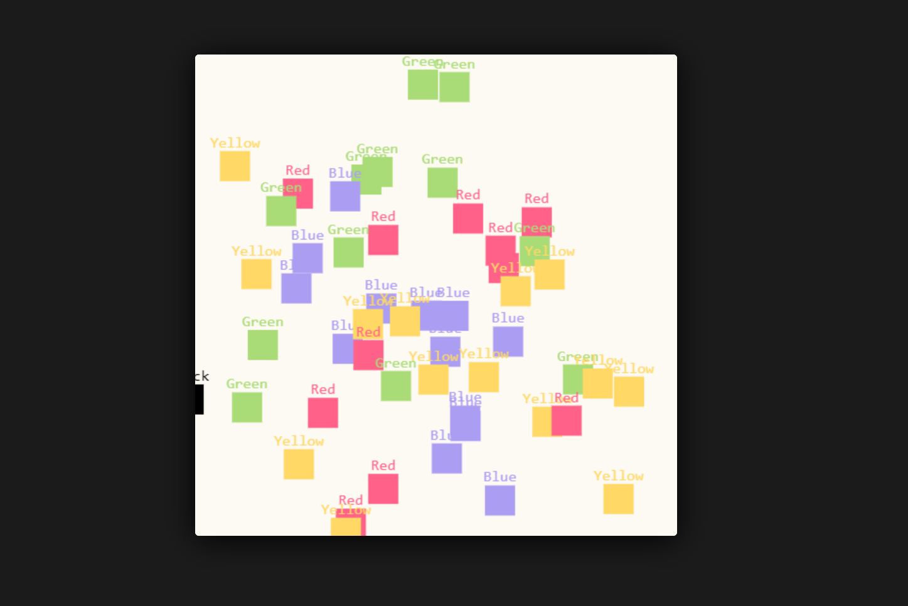

# SDE Pattern Program

Small game that we created for the SDE Program assignment written in TypeScript using the canvas for drawing. Click at any place on the screen to spawn randomly-moving squares!

 

## Patterns Used:

### Creational:
  - #### Singleton
    **Game** class uses Singleton pattern, since game should can be runned only once. Game class returns its instance using static `Game.getInstance()` method.

 

### Structural:
  - #### Facade
    **Game** class using Facade pattern for simplifying working with game instance. You can start or stop game using `Game.start()` & `Game.stop()` methods, or update all game entities states using `Game.update()` method.

  - #### Composite
    All entities stored in specific array in the **Game** class, and updated & drawn by Loop class. This array accepts any class extended from **Entity**. 

 

### Behavioral:
  - #### Template Method
    Each box in the game is a class that extends from the **Entity** class. They overwrite default entity parameters _(Like color & name)_, and also can overwrite **update** method for changing behavior, or overwrite **draw** method for changing way of rendering, but those changes is not implemented yet.

  - #### Observer
    Observer pattern used in the **Mouse** class. It has **onClick** & **onMove** methods, thats can be used to run callback function on specific mouse events.

 

## Responsibilities:

**Alex** - Build facade and singleton pattern, writing entities for the template method. Refactor and format code. 

**Kirill** - Make HTML template and add some CSS. Build template method, composite and observer pattern.
